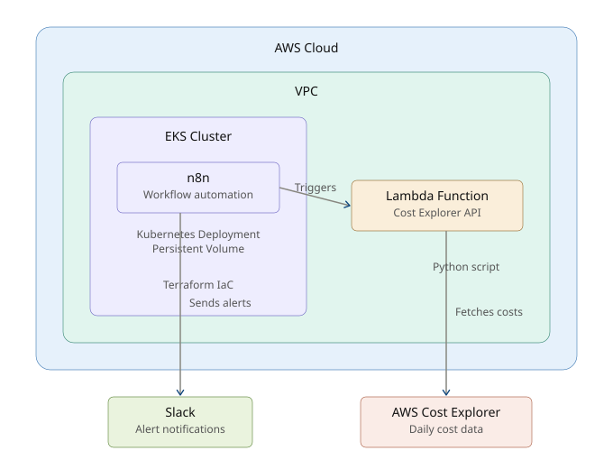

# n8n on AWS EKS - Cost Alerts Automation

Real-world Platform Engineering use case: Automated AWS cost monitoring using n8n deployed on EKS.



## 🎯 What This Does

- Deploys n8n workflow automation on AWS EKS
- Monitors AWS daily costs via Cost Explorer API
- Sends Slack alerts when spend exceeds threshold
- Fully automated infrastructure with Terraform

## 🏗️ Architecture

```
┌─────────────┐
│   AWS EKS   │
│             │
│  ┌───────┐  │      ┌──────────────┐
│  │  n8n  │──┼─────►│ AWS Lambda   │
│  │Workflow│  │      │Cost Explorer │
│  └───────┘  │      └──────────────┘
│      │      │
└──────┼──────┘
       │
       ▼
  ┌─────────┐
  │  Slack  │
  └─────────┘
```

## 📁 Repository Structure

```
.
├── README.md
├── terraform/
│   ├── main.tf              # Root module
│   ├── variables.tf         # Input variables
│   ├── outputs.tf           # Outputs
│   └── terraform.tfvars.example
├── modules/
│   ├── vpc/                 # VPC module
│   ├── eks/                 # EKS cluster module
│   └── n8n/                 # n8n deployment module
├── n8n-workflows/
│   └── aws-cost-alert.json  # n8n workflow definition
└── lambda/
    └── cost-checker.py      # Lambda function for Cost Explorer
```

## 🚀 Quick Start

### Prerequisites
- AWS CLI configured
- Terraform >= 1.5
- kubectl
- Slack workspace and webhook URL

### 1. Clone Repository
```bash
git clone https://github.com/YOUR_USERNAME/n8n-aws-cost-alerts.git
cd n8n-aws-cost-alerts
```

### 2. Configure Variables
```bash
cd terraform
cp terraform.tfvars.example terraform.tfvars
# Edit terraform.tfvars with your values
```

### 3. Deploy Infrastructure
```bash
terraform init
terraform plan
terraform apply
```

### 4. Configure n8n Workflow
```bash
# Get n8n URL
terraform output n8n_url

# Import workflow from n8n-workflows/aws-cost-alert.json
# Configure Slack webhook in n8n credentials
```

## 🔧 What Gets Deployed

- **VPC**: 2 public + 2 private subnets across 2 AZs
- **EKS Cluster**: Managed Kubernetes cluster
- **n8n**: Deployed as Kubernetes deployment with persistent volume
- **Lambda**: Cost Explorer API integration
- **IAM Roles**: Least-privilege permissions

## 💰 Cost Estimate

- EKS Cluster: ~$75/month
- EC2 Instances: ~$50/month (t3.medium nodes)
- NAT Gateway: ~$35/month
- **Total: ~$160/month**

## 📊 Workflow Logic

1. **Trigger**: Cron (daily at 9 AM UTC)
2. **Lambda**: Fetch yesterday's AWS cost
3. **Condition**: If cost > threshold
4. **Action**: Send Slack alert with cost breakdown

## 🛠️ Customization

### Change Cost Threshold
Edit `n8n-workflows/aws-cost-alert.json`:
```json
{
  "threshold": 100
}
```

### Add More Alerts
- Email via AWS SES
- PagerDuty integration
- Jira ticket creation

## 🧹 Cleanup

```bash
cd terraform
terraform destroy
```

## 📝 Blog Post

Coming soon: Full walkthrough on LinkedIn

## 👤 Author

**Ramalakshmi Mani (Rama)**  
Senior Cloud & Platform Engineer  
[LinkedIn](https://www.linkedin.com/in/ramalakshmim/)

## 📄 License

MIT License - Feel free to use and modify
